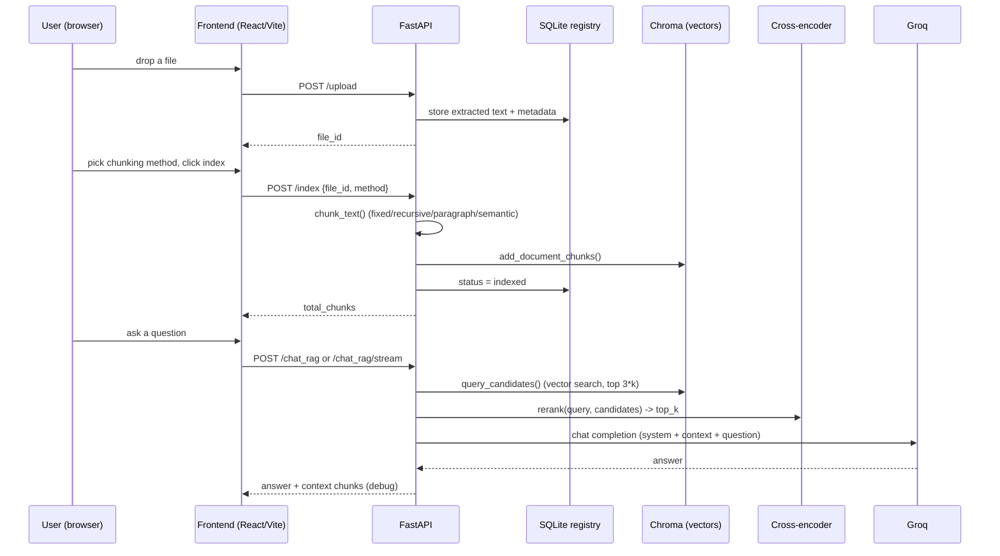

# Architecture

## Request flow



## Backend module map

```
main.py          app factory: CORS, request-id logging, global error handler,
                  lifespan hook (init SQLite, warn if no LLM key, close HTTP client)
config.py        pydantic-settings; every tunable lives here, sourced from
                  backend/.env (see .env.example)
routers/
  documents.py    /upload /index /documents /documents/{id}/preview
                  /documents/{id}/chunks /documents/{id} (DELETE)
                  /chunking-methods /stats
  chat.py         /query_rerank /chat_rag /chat_rag/stream (SSE)
  health.py       /health
schemas.py        every request/response Pydantic model in one file
chunkers.py       chunk_text(text, method, size, overlap) -> [str]
                  fixed | recursive | paragraph | semantic, all four actually
                  implemented (previously the UI advertised four but only
                  semantic existed on the backend)
vector_store.py   Chroma PersistentClient wrapper: add / query / delete /
                  get_document_chunks / count. Lazy-loaded singleton so
                  importing the module doesn't touch disk or load a model.
reranker.py       CrossEncoder wrapper, lazy-loaded, falls back to vector
                  distance ordering if the model fails to load/predict
llm.py            httpx.AsyncClient to Groq's OpenAI-compatible endpoint;
                  tenacity retry on 429/5xx; SSE token streaming;
                  strips <think> reasoning blocks from reasoning models
rag.py            retrieve() + build_system_prompt() + build_messages():
                  the one place prompt assembly happens (was duplicated
                  between two endpoints before)
storage.py        SQLite-backed document registry + extracted text on disk.
                  Replaces the original in-memory dict, which meant every
                  backend restart orphaned whatever was still in Chroma.
parsers.py        PDF (pypdf) / DOCX (python-docx) / text extraction with
                  an encoding fallback chain and a binary-content guard
```

## Frontend module map

```
api/client.js         fetch wrapper: JSON + multipart + SSE streaming,
                       typed ApiError with backend detail messages surfaced
hooks/
  useDocuments.js      owns the document list + index stats; upload/index/
                        reindex/delete all funnel through here so every
                        panel sees the same state
  useLocalStorage.js    persists persona/prompt/bot-name across reloads
                          (previously reset to defaults on every refresh)
components/
  leftPanel/            upload -> choose chunking method -> index -> inspect
                         (file preview / chunk preview), delete, re-index
  middlePanel/           chat (streaming or single-shot), markdown rendering,
                          retrieved-context inspector, live model/index stats
  rightPanel/             persona, system prompt, rules -- all live-wired to
                           the chat request body (previously two of three
                           inputs here were permanently `disabled` stubs)
  shared/                  Toast (error/success surfacing -- previously
                            failures only went to console.error)
```

## Design decisions worth knowing about

- **Chunking methods are query-able** (`GET /chunking-methods`): the frontend
  dropdown reads its options from the backend instead of a hardcoded list, so
  it cannot advertise a strategy the backend doesn't implement.
- **Re-indexing replaces, not appends.** `vector_store.add_document_chunks()`
  deletes any existing vectors for a `file_id` before writing new ones, so
  switching chunking methods on the same file doesn't leave orphaned vectors
  answering queries alongside the current ones.
- **Models load lazily and once.** The original code constructed
  `HuggingFaceEmbeddings` inside every `/index` call and `CrossEncoder` at
  import time. Both are now `@lru_cache`d factories, loaded on first use.
- **CORS is an explicit allow-list**, not `["*"]` + credentials (a combination
  browsers reject anyway).
- **Errors are typed, not generic 500s.** Missing LLM key -> 503. Bad/expired
  key -> 502. Provider rate limit -> retried with backoff, then 502 if still
  failing. Unsupported upload -> 415. This lets the frontend show the user
  something actionable instead of "Backend error, check console."
- **Streaming uses SSE over `fetch`, not `EventSource`**, because the request
  needs to be a POST with a JSON body (retrieved context, persona, rules),
  which `EventSource` cannot send.

## What's still out of scope

These are reasonable next steps that were **not** built, to keep this change
focused on making the existing feature set actually work end-to-end:

- **Auth / multi-tenant isolation.** Every document is visible to every
  client that can reach the API; there is no user/session boundary.
- **OCR for scanned PDFs.** `pypdf` extracts embedded text only.
- **A production vector DB.** Chroma's persistent client is file-based and
  fine for a single backend instance; it is not built for horizontal scaling
  or concurrent writers across multiple processes.
- **Async chunking/indexing.** `/index` is currently synchronous; semantic
  chunking a very large document will hold the request open for its full
  duration. A job queue (Celery/RQ/arq) would be the next step for large
  corpora.
